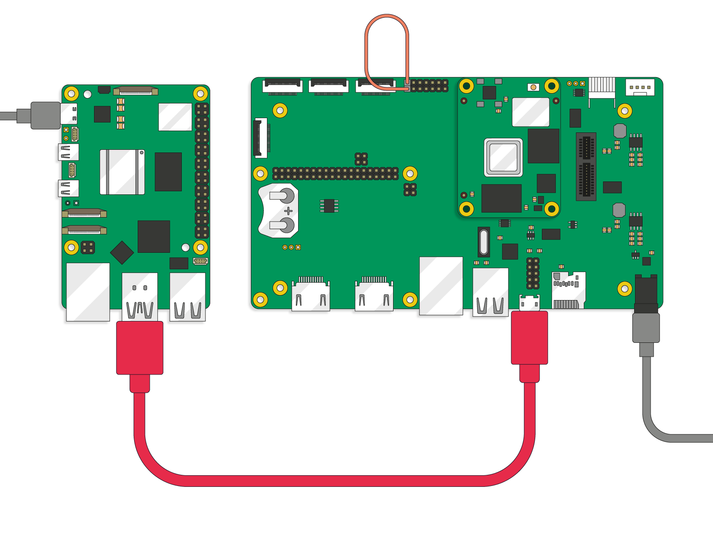
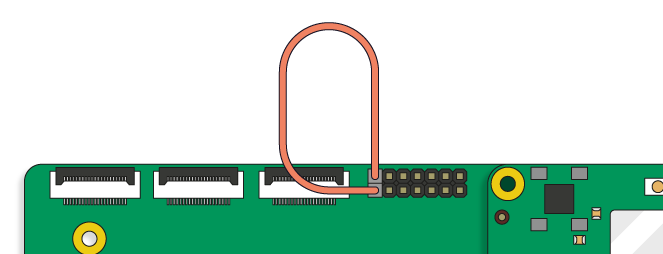

= rpi-sb-provisioner
Provisioning devices is the act of programming SD cards, NVMe or eMMC devices at manufacture time to put the device into a known and configured state.  For our embedded and industrial customers it is important that they can be sure that their signing keys are programmed correctly, boot security is enabled and the firmware stored in the EEPROM is set to a specific known value.

Secure Boot typically refers to an authenticated boot chain, where from the moment the main processor starts every components authenticates the next component before allowing it to execute.

In order to simplify the mass deployment of secure boot for Raspberry Pi Devices, we have introduced a new tool, the Raspberry Pi Secure Boot Provisioner.

This tool, referred to later in the document as `rpi-sb-provisioner`, is designed to fully automate:

* enforcing secure boot on Raspberry Pi devices
* the programming of firmware
* the programming of signing and device encryption keys
* tying the device encryption key to the storage device
* inserting a customer-supplied (created with `pi-gen`) operating system into an encrypted container on the storage device

For more information on creating an OS based on Raspberry Pi OS in `pi-gen`, consult the `pi-gen` repository at https://github.com/RPi-Distro/pi-gen

**NOTE**: This tool is under active development. Please report issues at https://github.com/raspberrypi/rpi-sb-provisioner

== Requirements for rpi-sb-provisioner

=== Required hardware for the provisioning system

* A Raspberry Pi 5 (or other 64-bit Raspberry Pi device)
* An official Raspberry Pi 5 Power Supply
* An installation of Raspberry Pi OS Bookworm, or later
* At least 32GB of storage, for temporary working files
* For provisoning Raspberry Pi Compute Module 4:
** A USB-A to microUSB-B cable
** A Raspberry Pi Compute Module 4 IO Board
** A single Jumper Wire

=== Hardware configuration

Connect your Raspberry Pi 5 to your Raspberry Pi Compute Module 4 IO Board as illustrated. Grey cables supply power, Red supplies data.

[pdfwidth=90%]
.A correctly connected provisioning set-up

=== Software configuration

`rpi-sb-provisioner` is provided from the Raspberry Pi OS APT repositories, and can be installed in the usual manner.

First, ensure you are running an up-to-date version of Raspberry Pi OS on your provisioning server:

----
$ sudo apt update && sudo apt full-upgrade -y
----

Now, install the `rpi-sb-provisioner` package from the releases area:

----
$ sudo dpkg -i rpi-sb-provisioner_foo.deb
$ sudo apt --fix-broken install
$ sudo reboot now
----

Next, you will have to configure `rpi-sb-provisioner` by using the TUI. In a terminal, run: 

----
$ configure.sh
----

WARNING: This will not work if you have not reboot after installing the package! 

Running this command will open up a full screen text UI. The TUI supports mouse input or keyboard navigation! 
Each of the boxes contains a name, text entry and help button. The steps for editing each parameter are as follows:

[pdfwidth=90%]
.A parameter entry area

*1 -* Click or use `tab` to click the help button to view the information about the parameter

*2 -* Navigate to the text field and enter the value you wish

*3 -* To stage this value for writing, you must click `return` on your keyboard. If the value is successfully verified, then the field will change color to green and a tick should appear. If validation fails, a warning popup should appear with some help text. A cross will also appear next to the parameter name.

[pdfwidth=90%]
.A successfully verified parameter

*4 -* Repeat the above steps to complete your required parameters (some are optional).

*5 -* Write to the configuration file by pressing the `Write verified params to config file` button at the bottom of the screen

Once you have followed all those steps, `rpi-sb-provisioner` should be correctly configured and ready to run.

== Configuration fields

Configure `rpi-sb-provisioner` by using the following fields in `/etc/rpi-sb-provisioner/config`

=== CUSTOMER_KEY_FILE_PEM
*Mandatory*

The fully qualified path to your signing key, encoded in PEM format. This file is expected to contain an RSA 2048-bit Private Key.

WARNING: This file should be considered key material, and should be protected while at rest and in use according to your threat model.

=== GOLD_MASTER_OS_FILE
*Mandatory*

This should be your 'gold master' OS image. No customisation should be present in this image that you would not expect to be deployed to your entire fleet. `rpi-sb-provisioner` assumes this image has been created using `pi-gen`, and using a non-`pi-gen` image may produce undefined behaviour.

=== RPI_DEVICE_STORAGE_TYPE
*Mandatory*

Specify the kind of storage your target will use. Supported values are `sd`, `emmc`, `nvme`.

=== RPI_DEVICE_FAMILY
*Mandatory*

Specify the family of Raspberry Pi device you are provisioning. Supported values are `4`. For example,

A Raspberry Pi Compute Module 4 would be family `4`

=== RPI_DEVICE_BOOTLOADER_CONFIG_FILE
*Mandatory, with a default*

WARNING: `rpi-sb-provisioner` will ignore the Raspberry Pi Bootloader configuration built by `pi-gen`, and use the one provided in this variable.

Specify the Raspberry Pi Bootloader configuration you want your provisioned devices to use. A default is provided.

Further information on the format of this configuration file can be found in the Raspberry Pi Documentation, at https://www.raspberrypi.com/documentation/computers/config_txt.html

=== RPI_DEVICE_LOCK_JTAG
*Optional*

Raspberry Pi devices have a mechanism to restrict JTAG access to the device.

Note that using this function will prevent Raspberry Pi engineers from being able to assist in debugging your device, should you request assitance.

Set to any value to enable the JTAG restrictions.

=== RPI_DEVICE_EEPROM_WP_SET
*Optional*

Raspberry Pi devices that use an EEPROM as part of their boot flow can configure that EEPROM to enable write protection - preventing modification.

Set to any value to enable EEPROM write protection.

=== RPI_DEVICE_SERIAL_STORE
*Optional, with a default*

Specify a location for the seen-devices storage directory. This directory will contain a zero-length file named with the serial number of each device seen, with the created files being used inside the state machine of `rpi-sb-provisioner`

=== RPI_SB_WORKDIR
*Optional*

WARNING: If you do not set this variable, your modified OS intermediates will not be stored, and will be unavailable for inspection.

Set to a location to cache OS assets between provisioning sessions. Recommended for use in production. For example:

----
RPI_SB_WORKDIR=/srv/rpi-sb-provisioner/
----

=== DEMO_MODE_ONLY
*Optional*

Set to `1` to allow the service to run without actually writing keys or OS images. You may, for example, use `DEMO_MODE_ONLY` in combination with `RPI_SB_WORKDIR` to inspect the modifications `rpi-sb-provisioner` would make to your OS ahead of deployment.

WARNING: Setting `DEMO_MODE_ONLY` will cause your seen-devices storage location to change to a subdirectory of the one specified by `RPI_DEVICE_SERIAL_STORE`, `demo/`

== Using rpi-sb-provisioner
`rpi-sb-provisioner` is composed of three `systemd` services that are triggered by the connection of a device in RPIBoot mode to a USB port. With `rpi-sb-provisioner` configured to your requirements, all that is therefore required is to connect your target Raspberry Pi device in RPIBoot mode.

For Raspberry Pi Compute Module 4 on Raspberry Pi Compute Module 4 IO Board, you can do this by using the single jumper wire to connect the `disable eMMC Boot` pins on the 12-pin header at the top of the board

[pdfwidth=90%]
.Force your Compute Module into RPIBoot mode by connecting the 'disable eMMC Boot' pins

After connecting your device in RPIBoot mode, `rpi-sb-provisioner` will perform the following steps:

* A new device connection is recognised over USB, and enters the *triage* phase:
** If your device does not have a file matching it's serial number in the directory pointed to by `RPI_DEVICE_SERIAL_STORE`, move to the *keywriter* phase
** If the device does have a file matching it's serial number in the directory pointed to by `RPI_DEVICE_SERIAL_STORE`, move to the *provisioner* phase.
* In the *keywriter* phase:
** Your device will boot a specialised Raspberry Pi firmware, designed to write a hash of your public signing key (generated from the file pointed to by `CUSTOMER_KEY_FILE_PEM`) into device One Time Programmable (OTP) memory
** Your device will be updated to Raspberry Pi EEPROM software released on 2024-05-17
** A file is created in the directory pointed to by `RPI_DEVICE_SERIAL_STORE`, named with the serial number of your device
** Your device will perform a silent reboot, moving back to the *triage* phase
* In the *provisioner* phase:
** `rpi-sb-provisioner` will boot your device with a specialised Linux distribution designed to:
*** create a device unique key
*** partition and format your device's storage
*** create a LUKSv2 container
*** place your OS into the LUKSv2 container
*** place a customised pre-boot authentication firmware (derived from your gold master OS image) into the 'boot' partition of your device's storage

After these steps have been completed, your device should display both the `activity` and `power` LEDs as `off`. If you have ethernet connected, you may still see activity from this port. In this state, your device is safe to power off and package into your product.

No further intervention is required in the success case.

WARNING: `rpi-sb-provisioner` will not, by default, block JTAG access. If you wish to make use of this facility, you _must_ specify this in the Raspberry Pi Bootloader configuration pointed to by `RPI_DEVICE_BOOTLOADER_CONFIG_FILE`

=== Monitoring via the monitoring application

`rpi-sb-provisioner` also contains a monitoring application. This can be used to observe the progress of a device as it is being provisioned. It also allows for easy introspection of the log files and lists all completed and failed devices.
The monitoring application supports both mouse or keyboard input. Navigation between boxes can be acheived by using the `tab` key or by clicking on the desired area.

To run, type into a terminal window:

----
$ monitor.sh
----

The TUI will intialise with 2 rows, the top one showing the progress of a device throughout the process, with each of the columns being for devices in the following stages: triaging, keywriting and provisoning.
When a device is connected, you will be able to watch it progress through each of the sections.
The second row of the TUI also has two boxes at the bottom, the left being successfully completed provisions and the right for failed provisions.
Clicking on the device name will open up a second window, with buttons to view the log files for each step of the provisioning service.
To return to the main monitoring screen, just press the key `m`.
To quit the app use the key combination `CTRL-C` or `q`.

== Debugging and audit

=== Observing active provisioning operations

As `rpi-sb-provisioner` is implemented using `systemd` services, you can use the typical `systemctl` commands to observe the services as they provision your device.

To see active provisioning operations, and the serial numbers of the devices involved, type into a Terminal window:

----
$ systemctl list-units rpi-sb-*
----

=== Observing logs

Logs are stored on a per-device, per-stage basis, where logs for a given device are stored at `/var/log/rpi-sb-provisioner/<serial>`. The logs for the *triage* stage, which is the state machine controlling rpi-sb-provisioner, are accessible via the systemd journal:

To observe the triage of an individual device, use `systemctl`

----
$ sudo systemctl status rpi-sb-triage@<serial>.service
----

For the *keywriter* and *provisioner* stages, logs are named per their stage in the log directory. For example, to observe the progress of an individual device through a stage, you could use `tail`:

----
$ tail -f -n 100 /var/log/rpi-sb-provisioner/<serial>/keywriter.log
$ tail -f -n 100 /var/log/rpi-sb-provisioner/<serial>/provisioner.log
----

=== Identifying secured devices

A 'secured device' is one where your customer signing key has been written - regardless of the state of your OS or other software. Such devices can only load Linux images signed by your customer signing key.

Obtain this by enumerating the files from the *Device Serial Store* directory:

----
ls <RPI_DEVICE_SERIAL_STORE>
----

WARNING: If you have set `DEMO_MODE_ONLY`, your demo mode seen files will be located at `<RPI_DEVICE_SERIAL_STORE>/demo`

=== Inspecting the image to be flashed

When run with `DEMO_MODE_ONLY=1`, `rpi-sb-provisioner` will only prepare images to be provisioned - allowing you to inspect the OS images prior to mass deployment.

WARNING: You must set `RPI_SB_WORKDIR` in the configuration file to observe the modified image. If you do not set `RPI_SB_WORKDIR`, the intermediates will be deleted at the completion of the run.

With both variables set, connect a device to be demo-provisioned per the provisoning instructions above.

The images will be located in the directory pointed to by `RPI_SB_WORKDIR`.

WARNING: Remember to unset `DEMO_MODE_ONLY` before moving to mass deployment.

=== Debugging unexpected results

The first stage of debugging unexpected results is to delete the contents of the directory pointed to by `RPI_SB_WORKDIR`, which will force any intermediate OS images to be deleted.

----
$ sudo rm ${RPI_SB_WORKDIR}/*
----

The second stage is to delete the corresponding `seen` file, matching the serial number of the device you are debugging, in the directory pointed to by `RPI_DEVICE_SERIAL_STORE`

----
$ sudo rm ${RPI_DEVICE_SERIAL_STORE}/<serial>
----
