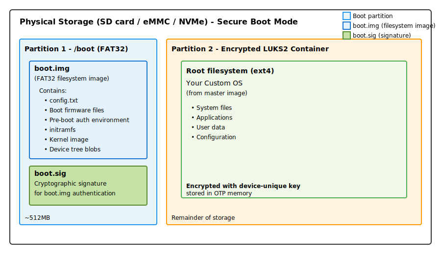
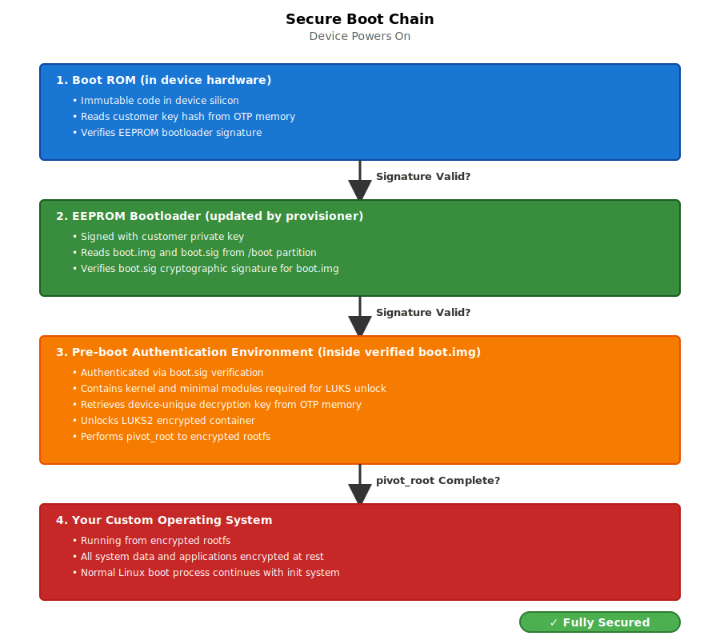
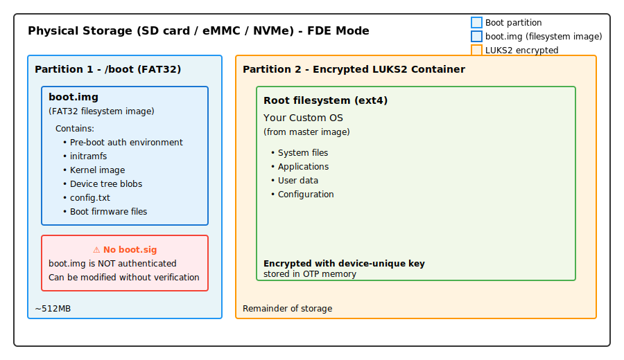
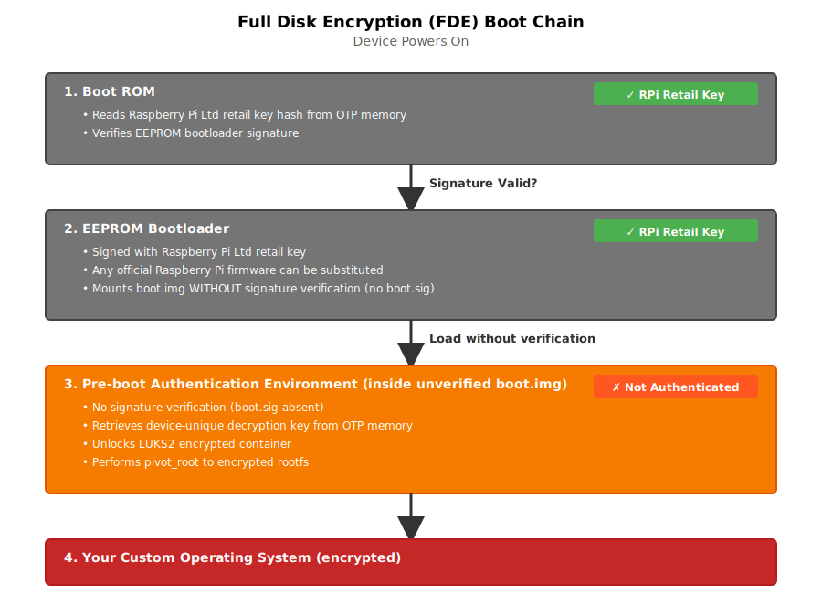
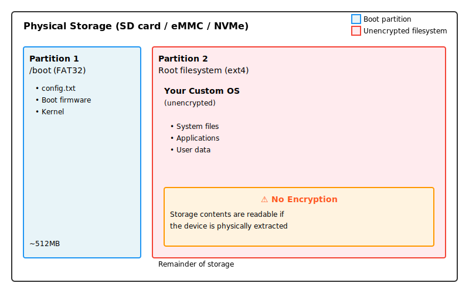

= System Architecture
:toc:
:toc-title: Contents
:toclevels: 3

_Technical overview of the rpi-sb-provisioner system design_

== Overview

The rpi-sb-provisioner is designed around a core principle: *transparency of action*. Every operation is explicit, auditable, and uses standard Linux tools and interfaces. The system is built from composable components that can be understood, inspected, and maintained independently.

=== Design Philosophy

The architecture prioritizes:

* *Transparency:* All operations are visible through standard Linux tools (systemd, journalctl, filesystem)
* *Auditability:* Comprehensive logging at every stage; operations can be traced and verified
* *Composability:* Separate concerns into distinct components that communicate through well-defined interfaces
* *Simplicity:* Prefer shell scripts and standard tools over complex frameworks
* *Security:* Minimize attack surface; operations run with minimal necessary privileges
* *Maintainability:* Code should be readable by system administrators, not just developers

=== High-Level Architecture

The system consists of five main components:

[cols="1,3,2"]
|===
|Component |Purpose |Implementation

|*udev Rules*
|Detect device connections and trigger provisioning
|udev rule file

|*systemd Services*
|Orchestrate provisioning workflow phases
|systemd template units

|*Shell Scripts*
|Execute provisioning operations
|POSIX shell scripts

|*Web Service*
|Provide monitoring and configuration interface
|C++ (Drogon framework)

|*Configuration*
|Store provisioning parameters and state
|Filesystem-based
|===

== Component Architecture

=== 1. Device Detection (udev)

The provisioning workflow begins with device detection.

==== udev Rules (`/lib/udev/rules.d/60-rpi-sb-provisioner.rules`)

Two rules detect Raspberry Pi devices in different boot states:

*Rule 1: RPIBOOT mode detection*
----
ACTION=="add", SUBSYSTEM=="usb", 
  ATTRS{idVendor}=="0a5c", ATTR{idProduct}=="2764|2710|2711|2712",
  TAG+="systemd",
  PROGRAM="/usr/bin/systemd-escape -p --template=rpi-sb-bootstrap@.service $env{DEVNAME}",
  ENV{SYSTEMD_WANTS}+="%c"
----

*Triggers when:* Raspberry Pi device connects in RPIBOOT mode (bootloader USB mode)

*Action:* Start `rpi-sb-bootstrap@.service` with the device path as parameter

*Product IDs:*
* `2764` - Reserved for boot ROM
* `2710` - Raspberry Pi 3 family devices
* `2711` - Raspberry Pi 4 family devices (Raspberry Pi 4, Compute Module 4, Zero 2 W)
* `2712` - Raspberry Pi 5 family devices (Raspberry Pi 5, Compute Module 5)

*Rule 2: fastboot mode detection*
----
ACTION=="add", SUBSYSTEM=="usb",
  ATTRS{idVendor}=="18d1", ATTR{idProduct}=="4e40", 
  ATTR{manufacturer}=="Raspberry Pi"
  TAG+="systemd",
  PROGRAM="/usr/bin/systemd-escape -p --template=rpi-sb-triage@.service $attr{serial}",
  ENV{SYSTEMD_WANTS}+="%c"
----

*Triggers when:* Device has been bootstrapped and enters fastboot mode

*Action:* Start `rpi-sb-triage@.service` with the device serial number as parameter

==== Why This Design?

* *Automatic triggering:* No manual intervention required; plugging in a device starts provisioning
* *systemd integration:* Leverages systemd's service management, logging, and monitoring
* *Device isolation:* Each device gets its own service instance (systemd template units)
* *Standard interface:* Uses udev, the standard Linux device management system

=== 2. Provisioning Workflow (systemd Services)

Provisioning proceeds through three phases, each implemented as a systemd template service.

==== Phase 1: Bootstrap (`rpi-sb-bootstrap@.service`)

*Purpose:* Initialize device, program security keys, update firmware

*Triggered by:* udev rule detecting RPIBOOT mode

*Key operations:*
* Load recovery firmware into device via rpiboot
* For secure boot mode: Program signing key hash into device OTP memory
* Update device EEPROM firmware
* Boot device into fastboot mode

*Script:* `/usr/bin/rpi-sb-bootstrap.sh`

*Logging:* `/var/log/rpi-sb-provisioner/<serial>/bootstrap.log`

*State tracking:* `/var/run/rpi-sb-state/<serial>/bootstrap`

==== Phase 2: Triage (`rpi-sb-triage@.service`)

*Purpose:* Determine provisioning mode and start appropriate provisioner

*Triggered by:* udev rule detecting fastboot mode

*Key operations:*
* Read configuration to determine `PROVISIONING_STYLE`
* Verify device is in fastboot mode
* Start appropriate provisioning service:
  - `secure-boot` → `rpi-sb-provisioner@.service`
  - `fde-only` → `rpi-fde-provisioner@.service`
  - `naked` → `rpi-naked-provisioner@.service`

*Script:* `/usr/bin/rpi-sb-triage.sh`

*Logging:* `/var/log/rpi-sb-provisioner/<serial>/triage.log`

*State tracking:* `/var/run/rpi-sb-state/<serial>/triage`

==== Phase 3: Provisioning (`rpi-*-provisioner@.service`)

*Purpose:* Deploy operating system and configure security

Three variants implement different security models:

*Secure Boot Provisioner* (`rpi-sb-provisioner@.service`)

* Create device-unique encryption key and store in OTP memory
* Partition and format storage
* Create LUKS2 encrypted container
* Deploy OS image into encrypted container
* Create pre-boot authentication environment (kernel + minimal modules)
* Sign EEPROM bootloader and pre-boot environment with customer key
* Configure secure boot chain

*Full Disk Encryption Provisioner* (`rpi-fde-provisioner@.service`)

* Create device-unique encryption key and store in OTP memory
* Partition and format storage
* Create LUKS2 encrypted container
* Deploy OS image into encrypted container
* Create pre-boot authentication environment (unsigned)

*Naked Provisioner* (`rpi-naked-provisioner@.service`)

* Partition and format storage
* Deploy OS image directly (no encryption)
* Install standard boot firmware (uses Raspberry Pi retail key)

*Scripts:*
* `/usr/bin/rpi-sb-provisioner.sh`
* `/usr/bin/rpi-fde-provisioner.sh`
* `/usr/bin/rpi-naked-provisioner.sh`

*Logging:* `/var/log/rpi-sb-provisioner/<serial>/provisioner.log`

*State tracking:* `/var/run/rpi-sb-state/<serial>/provisioner`

==== Why This Design?

* *Phase separation:* Each phase has clear responsibilities and can be debugged independently
* *Service isolation:* systemd ensures proper resource management and cleanup
* *Parallel execution:* Multiple devices can be provisioned simultaneously
* *Standard monitoring:* Use `systemctl` and `journalctl` for service inspection
* *Transparent state:* State files allow external monitoring without querying the service

=== 3. Shell Script Implementation

Core provisioning logic is implemented in POSIX shell scripts.

==== Script Structure

*Common functions* (`rpi-sb-common.sh`)

Shared utilities used by all phases:

* Configuration reading (`read_config`)
* Logging functions
* Device information extraction
* USB path resolution
* Error handling

*Phase-specific scripts*

Each phase has a dedicated script implementing its operations:

* Entry point receives device identifier from systemd
* Sources common functions
* Implements phase-specific logic
* Updates state files
* Records manufacturing data
* Returns exit code to systemd

==== Why Shell Scripts?

* *Transparency:* Operations are explicit command invocations, easy to trace
* *Debuggability:* Can be run manually for testing and troubleshooting
* *Standard tools:* Uses openssl, cryptsetup, fastboot, and other standard utilities
* *Inspectability:* System administrators can read and understand the code
* *Portability:* POSIX shell is universally available on Linux systems
* *Auditability:* Every command is visible in logs with `set -x`

=== 4. Web Service (provisioner-service)

A web service provides monitoring, configuration, and API access.

==== Implementation

*Technology:* C++ using Drogon web framework

*Purpose:*
* Web-based configuration interface
* Real-time device monitoring
* Manufacturing database access
* REST API for integration
* WebSocket support for live updates

==== Architecture

*HTTP endpoints:*

* `/options/*` - Configuration management
* `/devices/*` - Device status and logs
* `/api/v2/services` - Service monitoring
* `/api/v2/manufacturing` - Manufacturing database queries
* `/customisation/*` - Provisioning script management
* `/get-images` - OS image management

*WebSocket endpoints:*

* `/ws/devices` - Real-time device topology updates
* `/ws/sha256` - Live hash calculation progress

*Views:* Server-side templates (CSP files compiled to C++)

*Data sources:*

* systemd API (D-Bus) - Service status
* Filesystem - Logs, state files, configuration
* SQLite - Manufacturing database, audit log

==== Why This Design?

* *Separation of concerns:* Web service only monitors; shell scripts do the work
* *No privilege escalation:* Web service runs as unprivileged user; uses sudo only for specific read operations
* *Standard protocols:* HTTP REST API and WebSockets for integration
* *Stateless monitoring:* Service reads state from filesystem; does not maintain critical state
* *Fail-safe:* If web service crashes, provisioning continues unaffected

=== 5. Configuration and State Management

==== Configuration (`/etc/rpi-sb-provisioner/config`)

Simple key-value file format:
----
PROVISIONING_STYLE=secure-boot
RPI_DEVICE_FAMILY=5
RPI_DEVICE_STORAGE_TYPE=nvme
CUSTOMER_KEY_FILE_PEM=/path/to/key.pem
GOLD_MASTER_OS_FILE=/path/to/image.img
----

*Read by:* All shell scripts via `read_config` function

*Modified by:* Web service or manual editing

*Why:* Simple, transparent, version-controllable, easy to backup

==== State Tracking (`/var/run/rpi-sb-state/`)

Directory structure:
----
/var/run/rpi-sb-state/
  <serial>/
    bootstrap      # Bootstrap phase state
    triage         # Triage phase state
    provisioner    # Provisioning phase state
----

State files contain:
* Phase status (STARTED, FINISHED, ABORTED)
* Timestamps
* USB path information

*Purpose:* Allow web service and external tools to monitor progress without interfacing with systemd

*Why tmpfs:* State is ephemeral; cleared on reboot; should not persist

==== Logging (`/var/log/rpi-sb-provisioner/`)

Directory structure:
----
/var/log/rpi-sb-provisioner/
  <serial>/
    bootstrap.log       # Bootstrap phase operations
    triage.log          # Triage phase operations
    provisioner.log     # Provisioning phase operations
    keypair/            # Device-unique keys (if enabled)
      <serial>.der      # Private key
      <serial>.pub      # Public key
----

*Log format:* Timestamped entries with explicit command output

*Retention:* Persists across reboots; managed by logrotate

*Why:* Comprehensive audit trail; troubleshooting; compliance

==== Locking (`/var/lock/rpi-sb-provisioner/`)

Per-device lock directories prevent race conditions:
----
/var/lock/rpi-sb-provisioner/
  <serial>/
----

*Acquired by:* Each phase before starting operations

*Released by:* Phase completion or failure cleanup

*Why:* Prevents duplicate provisioning if device reconnects during process

==== Manufacturing Database (SQLite)

Optional database recording device information.

*Location:* Configurable (typically `/var/lib/rpi-sb-provisioner/manufacturing.db`)

*Schema:* Single table with device attributes:
* Serial number
* Board type and revision
* MAC addresses (Ethernet, Wi-Fi, Bluetooth)
* Storage information
* Security configuration
* Provisioning timestamp
* OS image details

*Purpose:* Track provisioned devices for inventory, warranty, and compliance

== Provisioned System Architecture

After provisioning is complete, the device has a specific security architecture depending on the provisioning mode.

=== Secure Boot Mode: Complete Architecture

In secure boot mode, the device implements a complete authenticated boot chain with encrypted storage.

==== Storage Layout

*Boot partition structure:*

Partition 1 contains two special files:

* *`boot.img`:* A FAT32 filesystem image file containing all boot components (firmware, kernel, initramfs, pre-boot authentication environment). The EEPROM bootloader mounts this image to access boot files.
* *`boot.sig`:* Cryptographic signature for `boot.img`, signed with customer private key. The EEPROM bootloader verifies this signature before mounting `boot.img`.

This encapsulation ensures the entire boot environment is authenticated as a single unit.

==== Secure Boot Chain

The boot process implements cryptographic verification at each stage:

*Key security properties:*

* *Authenticated boot chain:* Each component cryptographically verifies the next before execution
* *Customer key in hardware:* Key hash burned into device OTP memory (permanent, cannot be changed)
* *Signed components:* Only components signed with customer private key will execute
* *Encrypted storage:* All OS data protected by LUKS2 encryption
* *Device-unique keys:* Each device has unique encryption key stored in OTP memory
* *Automatic unlock:* Pre-boot environment retrieves decryption key from OTP memory; no user interaction required
* *Minimal pre-boot environment:* Contains only kernel and modules necessary for LUKS unlock and pivot_root

==== Security Guarantees

*What this prevents:*

* *Unauthorized code execution:* Device will not execute code not signed with customer key
* *Storage extraction:* Removing storage and reading it on another system yields only encrypted data
* *Key extraction from storage:* Decryption key is stored in device OTP memory, not on storage device
* *Device cloning:* Decryption keys are unique per device and stored in OTP; cannot clone storage to another device
* *Boot chain tampering:* Any modification to EEPROM bootloader or pre-boot environment will fail signature verification

*What this requires:*

* *Secure key management:* Customer private key must be protected (used for signing)
* *Trust in device hardware:* Security depends on device OTP memory and secure key storage

=== Full Disk Encryption (FDE) Mode: Architecture

FDE mode provides encrypted storage without secure boot enforcement.

==== Storage Layout

*Boot partition structure:*

Partition 1 contains:

* *`boot.img`:* A FAT32 filesystem image file containing boot components (pre-boot authentication environment, kernel, initramfs). The EEPROM bootloader mounts this image to access boot files.
* *No signature file:* Unlike secure boot mode, there is no `boot.sig` file. The `boot.img` is loaded without verification.

The storage layout is similar to secure boot mode (boot partition + LUKS2 container), but without boot authentication.

==== Boot Chain

*Key differences from secure boot mode:*

* *Raspberry Pi retail key:* EEPROM bootloader authenticated with Raspberry Pi Ltd retail key (not customer key)
* *Firmware substitution:* Any official Raspberry Pi firmware release can be substituted
* *No pre-boot verification:* Pre-boot authentication environment loaded WITHOUT signature verification
* *Encryption only:* Storage is encrypted, but pre-boot environment can be modified
* *Same unlock mechanism:* Uses OTP-stored decryption key and pivot_root

*Use case:* Scenarios requiring encryption without full boot chain authentication restrictions.

=== Naked Mode: Architecture

Naked mode provides basic OS deployment without security features.

*Boot partition structure:*

Partition 1 contains boot files directly (traditional Raspberry Pi layout):

* Standard boot firmware files
* Kernel and device tree files
* No encapsulation in `boot.img`
* No signature files

==== Storage Layout

==== Boot Chain

----
Device Powers On → Bootloader → Firmware → Kernel → Your OS
----

*Characteristics:*

* *No encryption:* Storage contents readable if device is extracted
* *EEPROM authenticated:* EEPROM bootloader uses Raspberry Pi retail key authentication
* *Kernel not authenticated:* No signature verification of kernel or boot files
* *Standard boot:* Conventional Raspberry Pi boot process
* *Fastest provisioning:* No encryption operations during deployment

*Use case:* Development environments, non-security-critical deployments, maximum compatibility.

=== Comparison of Provisioning Modes

[cols="1,2,2,2"]
|===
|Feature |Secure Boot |FDE Only |Naked

|*EEPROM authentication*
|✓ Customer key
|✓ RPi retail key
|✓ RPi retail key

|*Pre-boot environment auth*
|✓ Customer key
|✗ No
|N/A

|*Storage encryption*
|✓ Yes (LUKS2)
|✓ Yes (LUKS2)
|✗ No

|*Device-unique keys*
|✓ Yes
|✓ Yes
|✗ No

|*Customer firmware signing*
|✓ Yes
|✗ No
|✗ No

|*OTP customer key*
|✓ Yes (permanent)
|✗ No (RPi retail)
|✗ No (RPi retail)

|*OTP encryption key*
|✓ Yes
|✓ Yes
|✗ No

|*Storage extractable*
|✗ No (encrypted)
|✗ No (encrypted)
|✓ Yes (unencrypted)

|*Firmware substitution*
|✗ No (customer-signed only)
|✓ Yes (any RPi firmware)
|✓ Yes (any RPi firmware)

|*Pre-boot environment modifiable*
|✗ No (signature verification)
|✓ Yes (no verification)
|N/A

|*Provisioning time*
|Longest
|Medium
|Fastest

|*Security level*
|Maximum
|Medium
|Minimal

|*Use case*
|Production devices
|Encryption without boot restrictions
|Development, testing
|===

== Data Flow

=== Complete Provisioning Sequence

[source]
----
1. Device connects in RPIBOOT mode
   ↓
2. udev detects connection
   ↓
3. udev starts rpi-sb-bootstrap@<device>.service
   ↓
4. Bootstrap script:
   - Acquires device lock
   - Loads device via rpiboot
   - Programs security keys (if secure-boot)
   - Updates EEPROM firmware
   - Boots device into fastboot mode
   - Updates state: BOOTSTRAP-FINISHED
   ↓
5. Device reconnects in fastboot mode
   ↓
6. udev detects fastboot device
   ↓
7. udev starts rpi-sb-triage@<serial>.service
   ↓
8. Triage script:
   - Reads configuration
   - Determines PROVISIONING_STYLE
   - Starts appropriate provisioner service
   - Updates state: TRIAGE-FINISHED
   ↓
9. Provisioner service starts
   ↓
10. Provisioner script:
    - Partitions storage
    - Creates encryption (if enabled)
    - Deploys OS image
    - Configures boot firmware
    - Records manufacturing data
    - Updates state: PROVISIONER-FINISHED
    - Powers down device
   ↓
11. Device LEDs turn off
   ↓
12. Provisioning complete
----

=== Monitoring Flow

[source]
----
Web Browser → HTTP Request → provisioner-service
                                     ↓
                            systemd D-Bus API (service status)
                            /var/run/rpi-sb-state/ (state files)
                            /var/log/rpi-sb-provisioner/ (logs)
                            SQLite database (manufacturing data)
                                     ↓
                            HTTP Response / WebSocket message
                                     ↓
                            Web Browser (display)
----

== Design Rationale

=== Why Separate Bootstrap and Triage Phases?

*Bootstrap phase:* Device-specific hardware operations that must happen before storage is accessible

*Triage phase:* Configuration-dependent routing to appropriate provisioner

*Benefit:* Bootstrap can be tested independently of provisioning; triage logic is simple and fast

=== Why Shell Scripts Instead of Compiled Code?

*Transparency:* Every operation is a visible command invocation

*Debuggability:* Can be executed manually with `set -x` to see exactly what happens

*Maintainability:* System administrators can read and modify scripts without recompilation

*Auditability:* Logs show exact commands executed; no hidden operations

*Trust:* Users can inspect code to verify no unwanted operations occur

=== Why systemd Template Units?

*Isolation:* Each device gets independent service instance

*Resource management:* systemd handles process lifecycle, logging, and cleanup

*Monitoring:* Standard `systemctl` and `journalctl` commands work

*Dependency management:* Service ordering and dependencies are explicit

=== Why Filesystem-Based State?

*Transparency:* State is visible in filesystem; no hidden state

*Simplicity:* No database or complex state management needed

*Integration:* External tools can monitor state by reading files

*Durability:* Logs persist; ephemeral state is in tmpfs

=== Why Separate Web Service?

*Security:* Web service runs with minimal privileges; cannot disrupt provisioning

*Reliability:* Provisioning continues if web service fails

*Maintainability:* Web UI can be updated independently of core provisioning logic

*API access:* Provides programmatic interface for integration without modifying core scripts

== Security Considerations

=== Privilege Separation

* *Bootstrap/provisioning scripts:* Run as root (required for device access and storage operations)
* *Web service:* Runs as unprivileged user; uses sudo only for specific read operations
* *Configuration:* Protected by filesystem permissions
* *Signing keys:* Stored with restricted permissions; never exposed via API

=== Attack Surface Minimization

* *No network services on provisioned devices:* All communication via USB
* *No persistent state on provisioned devices during provisioning:* Device powers down after completion
* *Minimal dependencies:* Uses standard Linux tools; reduces potential vulnerabilities
* *Explicit operations:* No hidden functionality; all actions logged

=== Audit Trail

* *Comprehensive logging:* Every operation recorded with timestamp
* *Manufacturing database:* Optional tracking of all provisioned devices
* *Audit log:* Web service API access tracked with client information
* *State files:* Phase transitions recorded

== Extensibility

=== Adding New Provisioning Modes

1. Create new shell script (e.g., `rpi-custom-provisioner.sh`)
2. Add systemd service file (e.g., `rpi-custom-provisioner@.service`)
3. Modify triage script to recognize new `PROVISIONING_STYLE` value
4. Script implements provisioning logic using common functions

=== Custom Provisioning Hooks

Customisation scripts can be installed at various hook points:

* `bootstrap-begin` - Before bootstrap operations
* `bootstrap-end` - After bootstrap completion
* `mount-os` - After OS filesystem is mounted, before unmount
* `post-flash` - After image flashing, before device power-down

Hooks receive environment variables with device information and can modify mounted filesystems.

=== API Integration

HTTP API allows external systems to:

* Query manufacturing database
* Monitor device provisioning status
* Access provisioning logs
* Configure provisioning parameters

WebSocket API provides real-time updates for dashboards and monitoring tools.

== Deployment Considerations

=== System Requirements

* *Platform:* Raspberry Pi hardware (ARM64 architecture)
* *Operating system:* Raspberry Pi OS Bookworm or later
* *Storage:* NVMe SSD recommended for image hosting
* *Memory:* Sufficient for image caching (depends on OS image size)

=== Scaling

* *Horizontal:* Multiple provisioning servers, each handling subset of devices
* *Vertical:* Single server with multiple USB hubs for parallel provisioning
* *Database:* SQLite adequate for single server; export and merge for multi-server deployments

=== Backup and Recovery

*Critical data to backup:*

* Customer signing keys (`CUSTOMER_KEY_FILE_PEM`)
* Configuration file (`/etc/rpi-sb-provisioner/config`)
* Manufacturing database (if enabled)
* OS master images

*Not needed for backup:*

* Logs (useful for troubleshooting but not required for operation)
* State files (ephemeral; recreated during provisioning)
* Cache directories (recreated as needed)

== Troubleshooting Architecture

=== Service Dependency Chain

If provisioning fails, check in order:

1. *udev rules:* `udevadm test /sys/...` - Verify rule matches
2. *systemd services:* `systemctl status rpi-sb-*` - Check service state
3. *Shell scripts:* Logs in `/var/log/rpi-sb-provisioner/<serial>/` - Examine command output
4. *State files:* `/var/run/rpi-sb-state/<serial>/` - Verify phase transitions

=== Common Issues

*Device not detected:*

* Check udev rules are installed: `/lib/udev/rules.d/60-rpi-sb-provisioner.rules`
* Verify USB connection and device state
* Test with `lsusb` to confirm device is visible

*Service not starting:*

* Check systemd service files are installed: `/lib/systemd/system/rpi-sb-*.service`
* Verify scripts are executable: `/usr/bin/rpi-sb-*.sh`
* Check for lock directory conflicts: `/var/lock/rpi-sb-provisioner/`

*Provisioning fails:*

* Examine logs: `/var/log/rpi-sb-provisioner/<serial>/*.log`
* Check configuration: `/etc/rpi-sb-provisioner/config`
* Verify image file exists and is readable

== Summary

The rpi-sb-provisioner architecture prioritizes transparency, auditability, and maintainability. By using standard Linux components (udev, systemd, shell scripts) and explicit operations, the system ensures that users can understand, monitor, and trust the provisioning process. The separation of concerns between device detection, workflow orchestration, provisioning operations, and user interface allows each component to be tested, debugged, and maintained independently.

For implementation details, see:

* link:config_vars.adoc[Configuration Reference] - All configuration options
* link:api_endpoints.adoc[API Documentation] - Web service integration
* link:device-guidance/[Device Guidance] - Device-specific procedures
* link:mass-provisioning-guidance/scaling.adoc[Scaling Guide] - Production deployment

